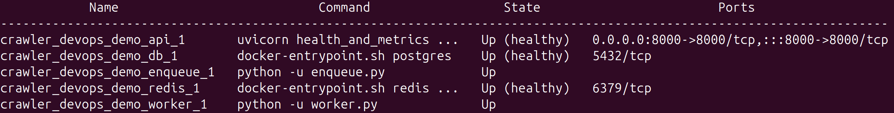
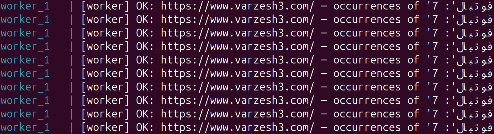
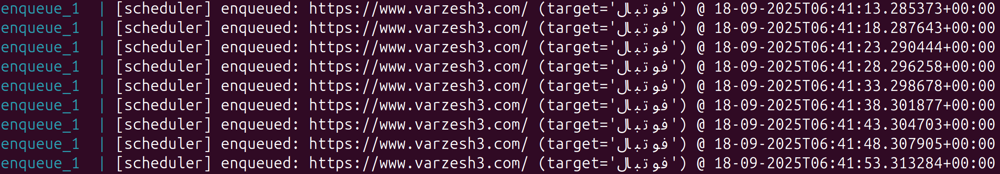
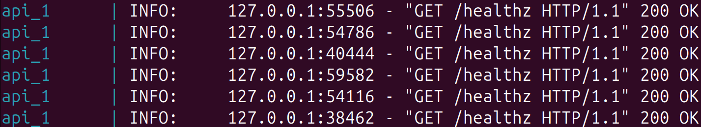
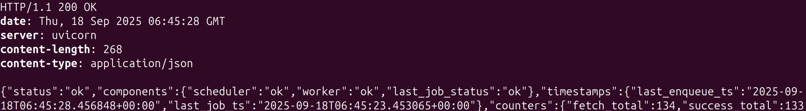
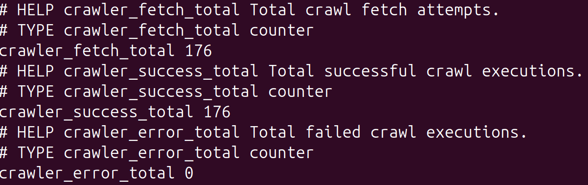
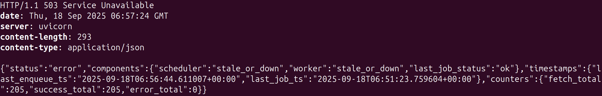

# A Simple Crawler (Redis queue + Postgres + FastAPI health/metrics)

- Pushes crawl jobs.
- Consumes jobs, writes metrics to Postgres, updates Redis counters.
- `/healthz` returns 200/503 based on freshness and last job status.
- `/metrics` exposes counters in Prometheus format.

## 1. Requirements
- Docker, Docker-compose, curl (for API testing).
- On Ubuntu:
```bash
sudo apt install docker docker-compose curl -y
```

## 2. Clone the Repository

```
git clone https://github.com/amirhoseinJ/crawler_devops_demo.git
```
```
cd crawler_devops_demo
```

## 3. Environmet Variables
- If you want to override default variables, copy .env.example to .env and edit it accordingly. Otherwise, defaults will be used.
```
cp .env.example .env
```
```
nano .env
```

- Table of editable variables:

| Service | Variable | Default Value |
|----------|----------|----------|
| Postgres   | POSTGRES_DB     | crawlerdb     |
| Postgres    | POSTGRES_USER     | crawleruser     |
| Postgres    | POSTGRES_PASSWORD   | postgres       |
| API   | API_PORT     | 8000     |
| API    | HEALTH_ENQUEUE_MAX_SECONDS     | 20     |
| API    | HEALTH_WORKER_MAX_SECONDS   | 25       |
| Crawler (worker)  | CRAWL_URL     | https://www.varzesh3.com/     |
| Crawler (worker)   | CRAWL_TARGET     | فوتبال     |
| Crawler (worker)   | CRAWL_DELAY_SECONDS   | 5       |

## 4. Build and Start
- In the main repo directory, execute:
```
sudo docker-compose up -d --build
```

## 5. Check Logs
- Docker-compose ps command:
```
sudo docker-compose ps
```



- Worker logs:
```
sudo docker-compose logs worker
```


- Enqueue logs:
```
sudo docker-compose logs enqueue
```


- API logs:
```
sudo docker-compose logs api
```


## 6. Test the API
- Check health:
```
curl -i http://localhost:8000/healthz
```


- Fetch metrics:
```
curl http://localhost:8000/metrics
```


- Simulate worker failure (or similiary, scheduler failure) and check health after timeout period:
```
sudo docker-compose stop worker
```
```
curl -i http://localhost:8000/healthz && echo
```


## 7. Terminate and Clean Up

- Remove containers, volumes, images, volumes:
```
sudo docker-compose down -v --rmi local --remove-orphans
```


## 8. Notes

- Healthz endpoint returns 503 error if any of the conditions below matches (and 200 ok otherwise):
  - Heartbeat of enqueue service (scheduler) is older than HEALTH_ENQUEUE_MAX_SECONDS.
  - Worker's last job timestamp is older than HEALTH_WORKER_MAX_SECONDS.
  - Last job's status is "error".
- To clear Redis counters, run:
```
sudo docker-compose exec redis redis-cli DEL \
  crawler:fetch_total crawler:success_total crawler:error_total \
  crawler:last_status crawler:last_ts crawler:last_error crawler:last_enqueue_ts
```
- Runbook: [runbook.md](./runbook.md)

